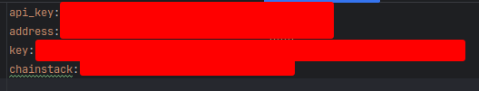
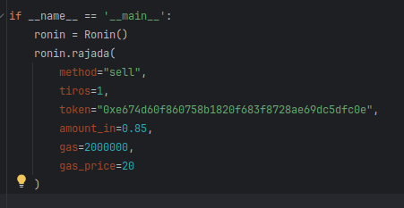

# Interacoes com a Ronin

Este programa tem por objetivo fazer com que sua carteira interaja com smart contracts na RONIN(https://roninchain.com).

## Onde posso executar?
- Local
- Local em uma imagem docker
- Na GCP via Cloud Run(o que possibilita automacoes agendadas, podendo, por exemplo, agendar blessed atia, feed axie, etc...)
  - Necessário que as chaves do arquivo `config.yml` estejam no secretmanager, substituindo o arquivo.

### Requisitos gerais
- Python 3.12^
- Arquivo de configuracao no root do projeto com o nome `config.yml` ou Secret Manager com as chaves necessárias.
  - O arquivo deve conter as chaves conforme a imagem abaixo. Sendo elas:
    - `api_key` Key da sua api na aplicacão da skymavis(https://docs.skymavis.com/api)
    - `address` sua carteira
    - `key` Key da sua ronin, vc consegue pegar na carteira
    - `chainstack` api key da chainstack (https://chainstack.com)(é de graca, mas se pagar tem vantagens)

### Rodando Local
Vc só precisa executar o arquivo `main.py` com os métodos que irá utilizar. No exemplo abaixo o script irá:
- orar para atia
- Usar um lucky pounch no axie onde o ID é o que vc definiu

### Rodando Local via docker
Mesma coisa, só que criando a imagem docker. Corre atrás ai, criar a imagem é easy.

### Rodando na GCP
Vc vai criar a imagem, enviar para o GCR, criar um JOB no cloud RUN e um Scheduler para executar o job. É necessário botar as chaves no secretmager da GCP.

Pesquisa ai como faz, pessoa vagabunda. É fácil.

## Outras funcionalidades interessantes do script

Na vdd, comecei a desenvolver o script para ter vantagens na copra de moeda no site https://tama.meme, que na época estava explodindo
e era muito ineficiente comprar e vender utilizando o site e a carteira.

A ideia era automatizar todo o processo e criar um bot, mas como o projeto não ganhou forca, acabei criando outras
funcionalidades.

Mas se quiser utilizar para este fim, é assim:

- vc define o método, que poderá ser:
  - sell
  - buy
- bota o token que quer comprar
- Em caso de buy, vc vai colocar a quantidade em RONs, no caso de sell, vc vai colocar a quantidade da moeda. Lembrando que se vc não tiver o token, falhará a venda(obvio, mas importante frisar)
- tiros - Quantas vezes o script comprará/venderá(cuidado, pq ele não dividirá o valor total, será esse valor em cada tiro)
- gas - Quanto maior, mais prioridade
- gas_price - valor máximo do gas

## Consideracões finais
É isso, não tenho interesse em roubar ninguém, então pode usar de boa. 

Alguém com a intencão de te roubar falaria isso, então leia a porra do código, tenha ela como uma base para criar os seus próprios.
Eu criei esse do zero, aprendi muita coisa, muito foi tentativa e erro pq essa merda não tem em qq lugar, então aproveita.
